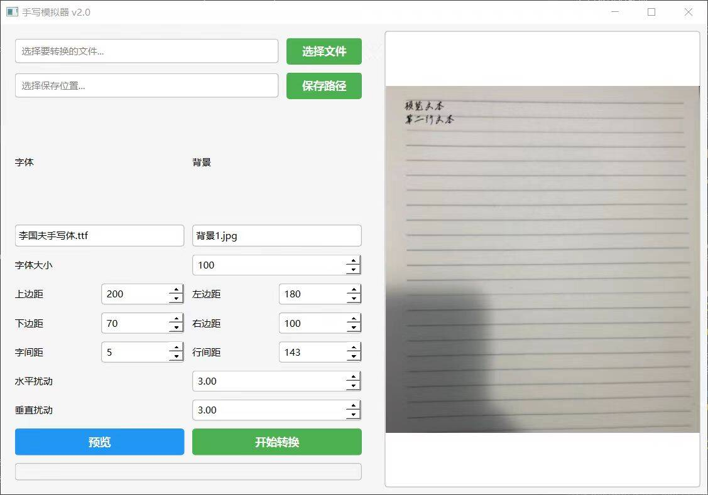

# Handwriting Simulator手写模拟器

这是一个手写模拟器应用，允许用户将文本文件（.txt、.doc、.docx）转换为手写风格的图像。用户可以自定义字体、背景、边距和其他参数，以实现个性化的手写效果。

## 功能

- **文件选择**：支持拖放文件或通过文件选择器选择文件。
- **参数设置**：用户可以自定义字体、背景、字体大小、边距、行间距和字间距等参数。
- **实时预览**：在转换之前可以查看手写效果的预览。
- **多页支持**：自动处理长文本，分割为多页手写图像。
- **进度指示**：在转换过程中显示进度和状态信息。

## 环境要求

- Python 3.x
- PyQt6
- Pillow
- docx2txt

## 安装依赖

在项目目录下运行以下命令以安装所需的依赖：

```bash
pip install PyQt6 Pillow docx2txt
```

## 使用方法

1. **选择输入文件**：
   - 点击“选择文件”按钮，选择要转换的文本文件。

2. **选择输出目录**：
   - 点击“保存路径”按钮，选择保存手写图像的目录。

3. **配置参数**：
   - 选择所需的字体和背景图像。
   - 根据需要设置字体大小、边距、行间距等参数。

4. **预览效果**：
   - 点击“预览”按钮查看手写效果。

5. **开始转换**：
   - 点击“开始转换”按钮开始处理文本并生成手写图像。
如图，为软件界面


## 文件结构

```
/HandwritingSimulator
│
├── /fonts              # 存放字体文件
├── /Background         # 存放背景图片
├── /Parameter          # 存放参数配置文件
├── write.py            # 主程序文件
└── README.md           # 本文档
```

## 注意事项
- 确保在运行程序之前将所需的字体和背景图片放置在相应的目录中。
- 程序支持的文件格式包括文本文件 (.txt) 和 Word 文档 (.doc, .docx)。
- 生成的手写图像将保存在同路径的outoput输出文件夹中。

## 目前已知bug（2024.12）
- 不能正确的对文本换行进行判断，导致文本被截断，以及其他细节问题...
（有空了改改）

## 许可证
此项目使用 MIT 许可证，详细信息请查看 [LICENSE](LICENSE) 文件。
